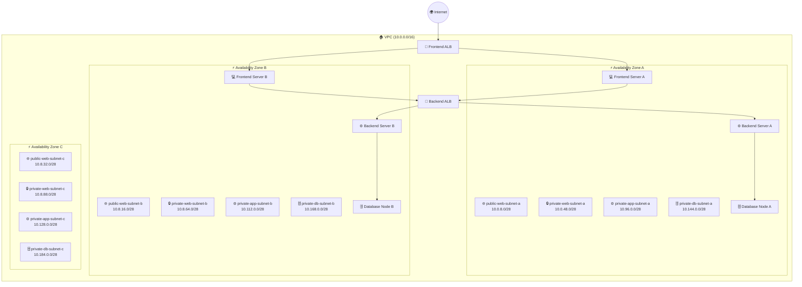
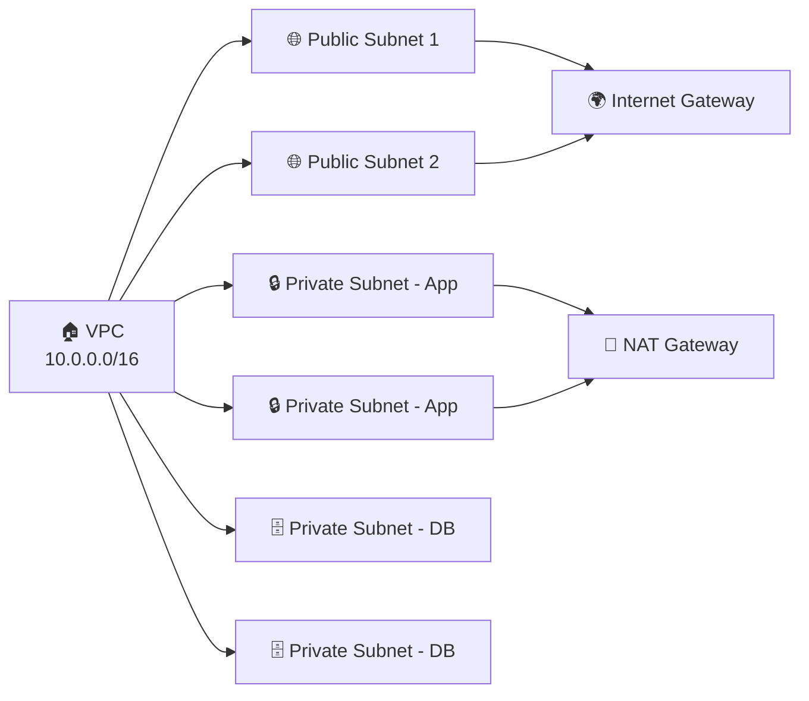
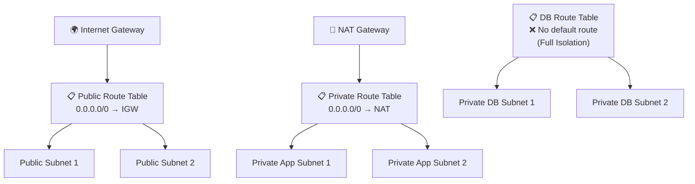
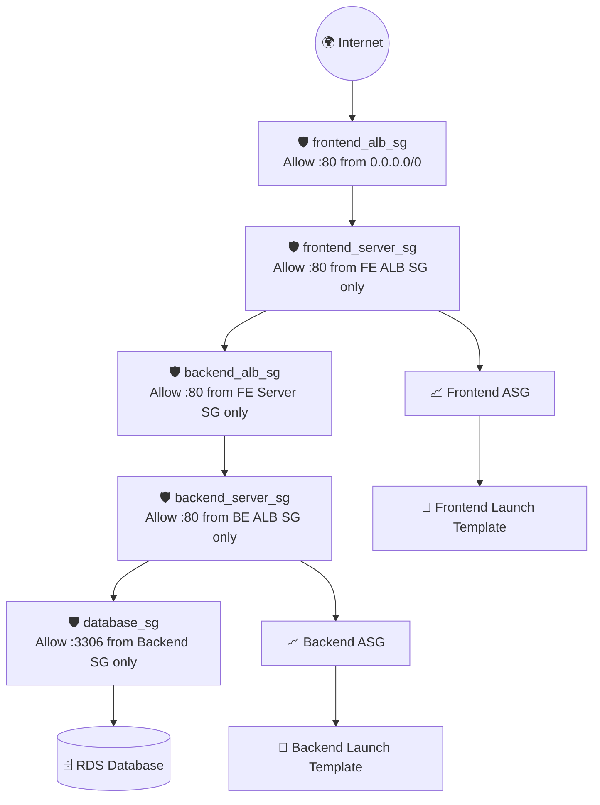
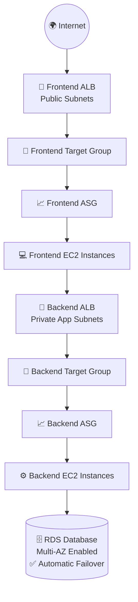
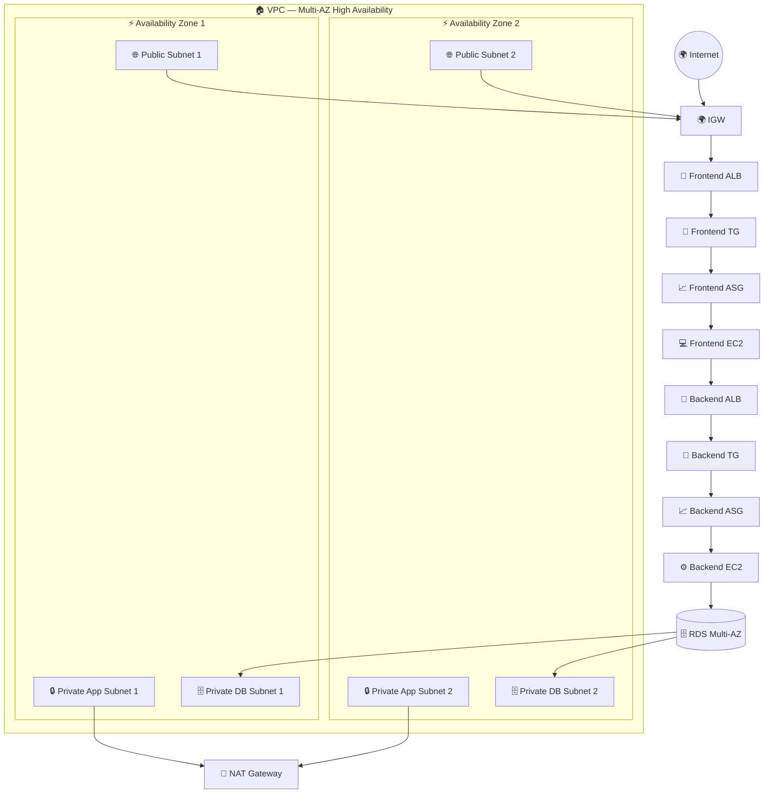

<br/>

<!-- BADGES ROW 1 -->


<!-- BADGES ROW 2 -->


<br/>

> **🚀 A production-grade, cloud-native Three-Tier Architecture deployed on AWS — showcasing real-world infrastructure design with Multi-AZ High Availability, layered security, and auto-scaling compute.**

<br/>

---

</div>

## 📖 Table of Contents

| # | Section |
|---|---------|
| 1 | [🎯 Project Overview](#-project-overview) |
| 2 | [🏛️ Architecture Overview](#%EF%B8%8F-architecture-overview) |
| 3 | [🧱 Tier Breakdown](#-tier-breakdown) |
| 4 | [📐 Phase-by-Phase Implementation](#-phase-by-phase-implementation) |
| 5 | [🔐 Security Architecture](#-security-architecture) |
| 6 | [⚒️ Components Reference Table](#%EF%B8%8F-components-reference-table) |
| 7 | [🎓 Learning Outcomes](#-learning-outcomes) |
| 8 | [📁 Folder Structure](#-folder-structure) |
| 9 | [👤 Contact](#-contact) |

---

## 🎯 Project Overview

<div align="center">

```
┌─────────────────────────────────────────────────────────────┐
│                                                             │
│   INTERNET  ──►  Frontend ALB  ──►  Web Tier (EC2)         │
│                                         │                   │
│                                         ▼                   │
│                              Backend ALB  ──►  App Tier     │
│                                                    │         │
│                                                    ▼         │
│                                          DB Tier (RDS)       │
│                                        [Multi-AZ Enabled]    │
│                                                             │
└─────────────────────────────────────────────────────────────┘
```

</div>

This project demonstrates how to design and deploy a **fully production-grade Three-Tier Architecture** on Amazon Web Services (AWS). The infrastructure is engineered for:

- ✅ **High Availability** — Resources span **3 Availability Zones** with failover built-in
- ✅ **Security** — Strict least-privilege Security Groups with **zero direct internet exposure** for App/DB tiers
- ✅ **Scalability** — Auto Scaling Groups dynamically manage EC2 capacity
- ✅ **Resilience** — Multi-AZ RDS ensures **zero-downtime** database failover
- ✅ **Network Isolation** — VPC with public/private subnet segmentation

---

## 🏛️ Architecture Overview

### 🌐 High-Level Traffic Flow



---

## 🧱 Tier Breakdown

<div align="center">

| Tier | Subnet Type | Components | CIDR Range |
|:----:|:-----------:|:----------:|:----------:|
| 🌐 **Web Tier** | Public | Frontend ALB, EC2 Web Servers | `10.0.8.0/28` per AZ |
| ⚙️ **App Tier** | Private | Backend ALB, EC2 App Servers | `10.96.0.0/28` per AZ |
| 🗄️ **DB Tier** | Private (Isolated) | RDS Multi-AZ | `10.144.0.0/28` per AZ |

</div>

### Subnet Topology

```
VPC: 10.0.0.0/16
│
├── 🌐 PUBLIC (Web Tier)
│   ├── public-web-subnet-a  →  10.0.8.0/28   [AZ-A]
│   ├── public-web-subnet-b  →  10.8.16.0/28  [AZ-B]
│   └── public-web-subnet-c  →  10.8.32.0/28  [AZ-C]
│
├── 🔒 PRIVATE (Web Hosts)
│   ├── private-web-subnet-a →  10.0.48.0/28  [AZ-A]
│   ├── private-web-subnet-b →  10.8.64.0/28  [AZ-B]
│   └── private-web-subnet-c →  10.8.88.0/28  [AZ-C]
│
├── ⚙️ PRIVATE (App Tier)
│   ├── private-app-subnet-a →  10.96.0.0/28  [AZ-A]
│   ├── private-app-subnet-b →  10.112.0.0/28 [AZ-B]
│   └── private-app-subnet-c →  10.128.0.0/28 [AZ-C]
│
└── 🗄️ PRIVATE (DB Tier — FULLY ISOLATED)
    ├── private-db-subnet-a  →  10.144.0.0/28 [AZ-A]
    ├── private-db-subnet-b  →  10.168.0.0/28 [AZ-B]
    └── private-db-subnet-c  →  10.184.0.0/28 [AZ-C]
```

---

## 📐 Phase-by-Phase Implementation

### 🔷 Phase 1 — VPC & Subnet Foundation

> *Establishes the foundational network environment with proper resource segregation for security and availability.*



**Steps:**
1. **Create VPC** with CIDR `10.0.0.0/16`
2. **Create 12 Subnets** across 3 AZs:
   - 3× Public Web Subnets
   - 3× Private Web Subnets
   - 3× Private App Subnets
   - 3× Private DB Subnets

---

### 🔷 Phase 2 — Connectivity & Routing

> *Configures how traffic enters (IGW) and how private resources access the internet securely (NAT Gateway).*



**Steps:**
3. **Create & attach Internet Gateway (IGW)** to the VPC
4. **Allocate Elastic IP** → Create **NAT Gateway** in `public-web-subnet-a`
5. **Configure 3 Route Tables:**
   - 🌐 Public RT → `0.0.0.0/0` → IGW
   - 🔒 Private App RT → `0.0.0.0/0` → NAT Gateway
   - 🗄️ Private DB RT → **No default route** (fully isolated)
6. **Associate** each Route Table to its respective subnets

---

### 🔷 Phase 3 — Security Groups & EC2 Auto Scaling

> *Defines network security boundaries using the principle of least privilege, with Auto Scaling for resilience.*



**Steps:**
7. **Create 5 Security Groups** (chained least-privilege rules):

   | Security Group | Allows | Source |
   |:---|:---|:---|
   | `frontend_alb_sg` | HTTP :80 | `0.0.0.0/0` (Internet) |
   | `frontend_server_sg` | HTTP :80 | `frontend_alb_sg` only |
   | `backend_alb_sg` | HTTP :80 | `frontend_server_sg` only |
   | `backend_server_sg` | HTTP :80 | `backend_alb_sg` only |
   | `database_sg` | MySQL :3306 | `backend_server_sg` only |

8. **Create Launch Templates** (with IAM Roles for CloudWatch/S3)
9. **Create Auto Scaling Groups** for Frontend and Backend servers

---

### 🔷 Phase 4 — Load Balancers & Multi-AZ Database

> *Connects tiers via ALBs and establishes the highly available database layer.*



**Steps:**
9. **Create Frontend ALB** → Public Subnets → Target: Frontend ASG
10. **Create Backend ALB** → Private App Subnets → Target: Backend ASG
11. **Create DB Subnet Group** using Private DB Subnets
12. **Launch RDS Multi-AZ** instance into the DB Subnet Group

---

### 🏁 Full Architecture — Final State



---

## 🔐 Security Architecture

<div align="center">

```
╔══════════════════════════════════════════════════════════╗
║              SECURITY CHAIN — ZERO TRUST                 ║
║                                                          ║
║  [Internet] → [FE ALB SG] → [FE Server SG]              ║
║                                  ↓                       ║
║             [BE ALB SG] ← ─ ─ ─ ┘                       ║
║                  ↓                                       ║
║            [BE Server SG] → [Database SG]               ║
║                                                          ║
║  ✅ No tier can bypass the previous layer               ║
║  ✅ DB is unreachable from internet — ever              ║
║  ✅ Every SG rule references a SG, not an IP            ║
╚══════════════════════════════════════════════════════════╝
```

</div>

---

## ⚒️ Components Reference Table

<div align="center">

| Category | Component | Placement / Configuration |
|:--------:|:---------:|:-------------------------:|
| 🏠 **Networking** | VPC | Single VPC `10.0.0.0/16` |
| | Subnets | 12 total — Public, Private App, Private DB |
| | Internet Gateway | Attached to VPC for public inbound/outbound |
| | NAT Gateway | In 1 Public Subnet, enables private → internet |
| | Route Tables | Public, Private App, Private DB (Isolated) |
| 💻 **Compute** | EC2 Frontend | Web Tier — behind Frontend ALB |
| | EC2 Backend | App Tier — behind Backend ALB |
| | Auto Scaling Groups | Dynamic scaling for both Frontend & Backend |
| 🔀 **Load Balancing** | Frontend ALB | Public Subnets — user entry point |
| | Backend ALB | Private Subnets — Web→App routing |
| 🗄️ **Database** | RDS Multi-AZ | Private DB Subnets — automatic failover |
| 🔐 **Security** | Security Groups | Chained least-privilege rules across all 5 tiers |
| | IAM Roles | EC2 access to CloudWatch, S3, Parameter Store |

</div>

---

## 🎓 Learning Outcomes

<div align="center">

```
┌─────────────────────────────────────────────────────────────┐
│  🎯  SKILLS DEMONSTRATED IN THIS PROJECT                    │
└─────────────────────────────────────────────────────────────┘
```

</div>

| # | Skill | Concept Mastered |
|---|-------|-----------------|
| 1 | 🏗️ **Multi-AZ VPC Design** | Spanning resources across AZs for HA |
| 2 | 🔀 **Subnet Tiering** | Public vs Private subnet isolation strategy |
| 3 | 🚪 **NAT vs IGW Routing** | Inbound/outbound patterns for each tier |
| 4 | 🔄 **ALB → EC2 → Backend Flow** | End-to-end load-balanced traffic tracing |
| 5 | 🔐 **Least Privilege SGs** | Chained security group referencing |
| 6 | 📈 **Auto Scaling** | Dynamic compute with Launch Templates |
| 7 | 🗄️ **Multi-AZ RDS** | Database high availability & failover |
| 8 | 🛣️ **Route Table Design** | Isolated DB routing with no default route |

---

## 📁 Folder Structure

```
aws-skill-builder-projects/
│
└── 📂 three-tier-architecture/
    │
    ├── 📄 README.md                   ← You are here
    │
    ├── 📂 diagrams/
    │   └── 🖼️  architecture.png        ← Full architecture diagram
    │
    ├── 📂 terraform/                  ← Infrastructure as Code (Terraform)
    │   ├── main.tf
    │   ├── variables.tf
    │   ├── outputs.tf
    │   └── modules/
    │       ├── vpc/
    │       ├── ec2/
    │       ├── alb/
    │       └── rds/
    │
    ├── 📂 cloudformation/             ← CloudFormation Templates
    │   ├── vpc-stack.yaml
    │   ├── compute-stack.yaml
    │   └── database-stack.yaml
    │
    ├── 📂 notes/                      ← Study notes & references
    │   └── architecture-decisions.md
    │
    └── 📂 future-projects/            ← Upcoming additions
        └── serverless-tier/
```

---

## 👤 Contact

<div align="center">


[](https://www.linkedin.com/in/arkan-tandel)
[](https://github.com/arkan-tandel)
[](mailto:arkan@example.com)

</div>

---

<div align="center">


</div>
